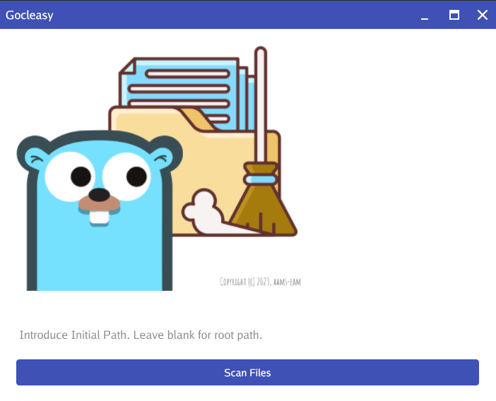
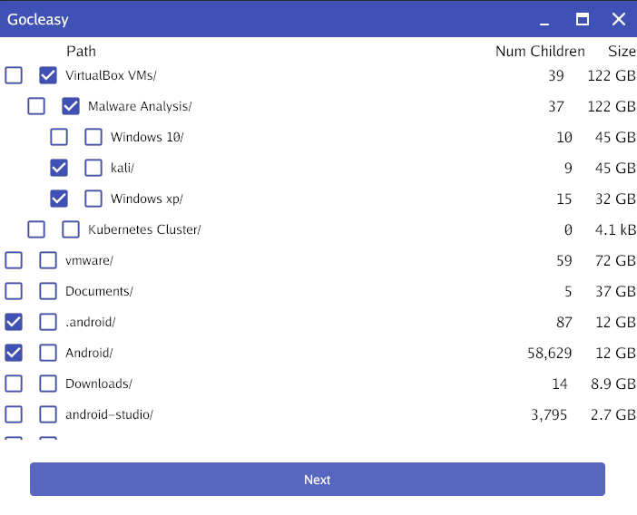
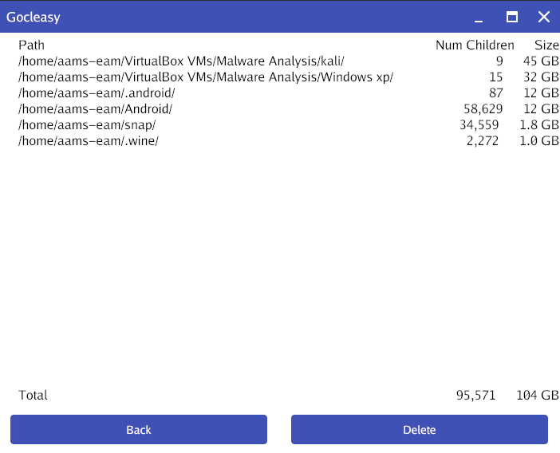

# GoCleasy
GoCleasy is a **Fast**, **Intuitive**, and **Easy** Golang Solution for Freeing Up Disk Space!
It is a lightweight Golang application designed with one purpose in mind: to help you identify and delete heavy files effortlessly. You can scan your entire system or the path you select, analyzing file sizes with remarkable speed.
Whether you're a tech professional or a casual user, GoCleasy empowers you to reclaim valuable disk space without the headaches.

You can liberate space from your disk by following the next steps:
## Download the Executable
The application is portable, you don't need to install anything, just download the executable and ready to liberate space. You can download executables for different OS [here](https://github.com/aams-eam/gocleasy/releases).
## Initial Path Selection
When opening the application you can select an initial path or leave blank for analyzing the whole disk.   

## File Selection
Once the scan has finished the files and folders will be shown. Biggest files first, you can select folders and files and navigate through the tree. The first checkbox is for selecting the file for deletion, the second checkbox is for opening a folder to see its content.   

## Delete
Finally, you can Go Clean Easy and confirm your selection. Click "Delete" to liberate the disk from those big useless files...   



# Contributions
## How to contribute?
If you are thinking about any improvement, go ahead, we'd love to have your contributions! Feel free to create Pull Requests and help us improve the tool together!

## How to create an executable?
Creating an executable is really simple, clone the project and execute:
```
go build -o main main.go
```
Yep, just that!

## Executables for Android
You can create an executable for Android with [gogio](https://gioui.org/doc/install/android), but you will need to modify the application to request READ_EXTERNAL_STORAGE permissions. I didn't have the time to develop that; I tried with gioui and golang, but apparently the best option could be to do it in JAVA and create a connector.

# License
Licensed under the GNU General Public License v3.0.
